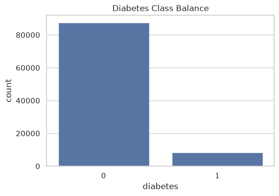
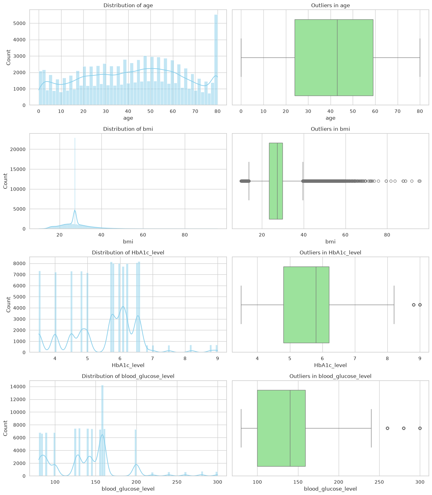
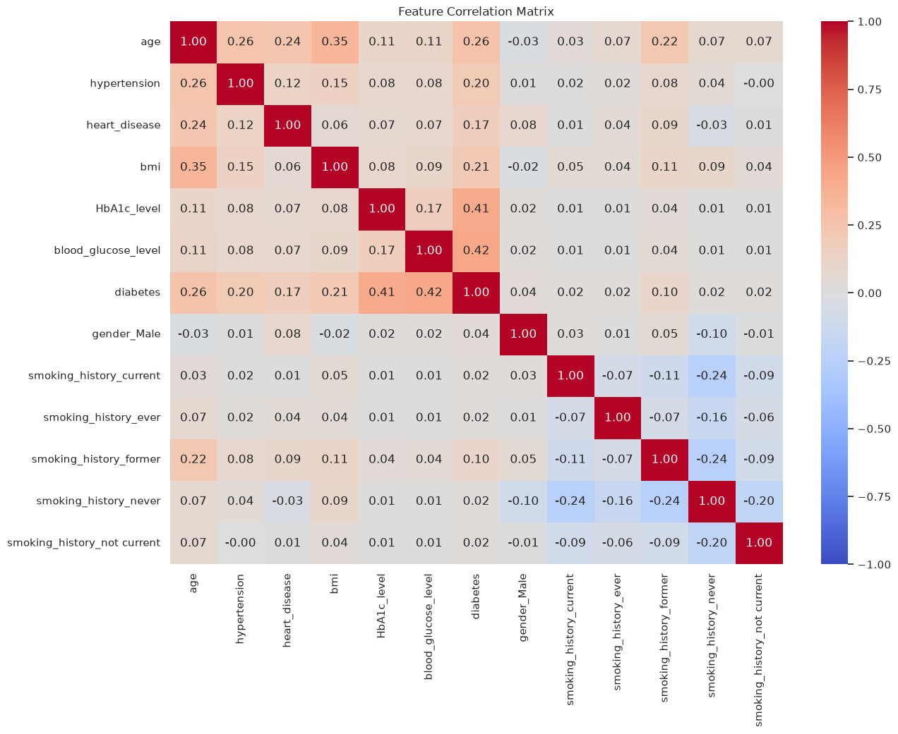
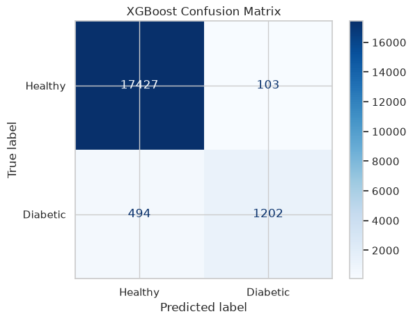
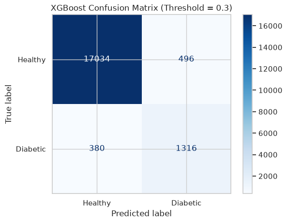
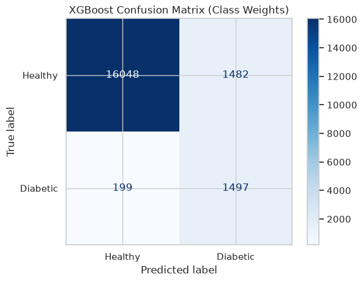

# Diabetes Prediction Model

## Table of Contents

- [1. Project Overview](#1-project-overview)
- [2. Methodology & Process](#2-methodology--process)
- [3. Models Deployed](#3-models-deployed)
- [4. Outputs & Results](#4-outputs--results)
- [5. Interpretation & Insights](#5-interpretation--insights)
- [6. Deployment Application](#6-deployment-application)
- [7. Reproducing the Project on GitHub](#7-reproducing-the-project-on-github)

## 1. Project Overview

This project is a diabetes diagnostic screening tool built to support early risk detection rather than final diagnosis. Its core objective is to maximize recall for the diabetic class so the model misses as few true cases as possible. In a screening setting, that is the correct priority: a false positive may create extra follow-up work, but a false negative can delay testing, delay treatment, and allow disease progression.

The notebook provides the full data science workflow, from exploratory analysis to model comparison and deployment artifacts. The Streamlit app in `main.py` is the lightweight front end that turns the trained pipeline into an interactive clinical screening interface.

## 2. Methodology & Process

The work begins with data cleaning and exploratory data analysis, then moves into feature engineering, leakage-safe preprocessing, imbalance handling, and model training.

### Data loading and cleaning

The notebook loads `diabetes_prediction_dataset.csv`, removes duplicate rows, and drops the rare `gender == "Other"` records so the gender feature remains binary. Categorical variables are converted into machine-readable form with one-hot encoding, using `drop_first=True` in the early cleaning stage to avoid redundant dummy variables.

### Exploratory data analysis

The first analytical check is the target balance. The dataset is heavily skewed toward non-diabetic cases, which immediately signals the need for recall-oriented modeling and imbalance-aware training.



The continuous variables are then inspected with histograms and boxplots. This makes the shape of the medical measurements visible and highlights the outliers and discretization patterns that matter for model design.



The correlation matrix is used to measure how much predictive signal is carried by each feature. As expected, glucose-related variables dominate, while demographic and lifestyle variables contribute more weakly.



The notebook also runs chi-square tests on binary and categorical features to confirm statistical association with the target. Those tests show that the categorical variables are not noise; they are informative enough to keep in the modeling set.

### Feature engineering

Two medically meaningful features are derived from the raw inputs:

- BMI is binned into Underweight, Normal, Overweight, and Obese.
- Age is binned into Child, Teen, Adult, and Senior.

These bins let the model learn coarser clinical risk patterns, which is often more useful than forcing it to infer them from raw numeric values alone. The derived categories are one-hot encoded so the model can treat each risk band separately.

### Data leakage prevention through scaling

The dataset is split into training and test sets with stratification, preserving the class ratio across both splits. `StandardScaler` is then fit only on the training set and applied to the test set afterward.

That detail is essential: if the scaler were fit on the entire dataset, the holdout data would leak into training. By fitting on training only, the notebook keeps evaluation honest and ensures the reported metrics reflect generalization rather than contamination.

### Handling class imbalance

The notebook uses SMOTE to balance the training set before training the baseline classifiers. That gives the models enough minority-class examples to learn from without touching the test set.

After the SMOTE-balanced baseline comparison, the notebook explores two recall-focused XGBoost strategies:

- threshold tuning, where the positive-class cutoff is lowered from 0.5 to 0.3;
- class weighting, where `scale_pos_weight` is derived from the original imbalance so the model penalizes diabetic misses more heavily.

The threshold adjustment makes the model more sensitive at prediction time. The class-weighted version changes the learning process itself, which is why it is ultimately the deployed model.

### Model-saving step

The final XGBoost model is saved as `xgboost_diabetes_model.pkl`, and the fitted scaler is saved as `scaler.pkl`. Those two artifacts are all the Streamlit app needs to reproduce the trained pipeline exactly.

## 3. Models Deployed

### Logistic Regression

This is the linear baseline. It is fast, interpretable, and a useful benchmark, but it struggles when the boundary between diabetic and non-diabetic cases is non-linear.

### Decision Tree

This model captures if-then style rules and non-linear interactions without requiring parametric assumptions. It is easier to interpret than ensemble methods, but a single tree can be unstable and more prone to overfitting.

### Random Forest

This ensemble averages many decision trees and reduces variance relative to a single tree. It is usually stronger than a standalone tree on tabular health data, but it still lacks the sequential error correction of boosting.

### XGBoost

XGBoost is the strongest model in the notebook and the one used for deployment. It builds trees sequentially, with each new tree correcting the residual errors of the previous ones. The notebook evaluates three XGBoost variants:

- default XGBoost trained on the SMOTE-balanced data;
- threshold-adjusted XGBoost with a lower probability cutoff;
- class-weighted XGBoost trained on the original imbalanced data with `scale_pos_weight`.

The class-weighted version is the exported model because it best matches the project goal: maximize recall for the diabetic class.

## 4. Outputs & Results

The table below reproduces the exact classification-report metrics printed by the notebook outputs.

| Model | Healthy Precision | Healthy Recall | Healthy F1 | Diabetic Precision | Diabetic Recall | Diabetic F1 | Accuracy |
| --- | ---: | ---: | ---: | ---: | ---: | ---: | ---: |
| Logistic Regression | 0.99 | 0.88 | 0.93 | 0.42 | 0.88 | 0.57 | 0.88 |
| Decision Tree | 0.97 | 0.97 | 0.97 | 0.68 | 0.74 | 0.71 | 0.95 |
| Random Forest | 0.98 | 0.97 | 0.98 | 0.74 | 0.76 | 0.75 | 0.96 |
| XGBoost | 0.97 | 0.99 | 0.98 | 0.92 | 0.71 | 0.80 | 0.97 |
| XGBoost Threshold 0.3 | 0.98 | 0.97 | 0.97 | 0.73 | 0.78 | 0.75 | 0.95 |
| XGBoost Class Weights | 0.99 | 0.92 | 0.95 | 0.50 | 0.88 | 0.64 | 0.91 |

The thresholded and weighted XGBoost variants are the most relevant results for a medical screening workflow because they directly tune the recall-precision trade-off.



The default XGBoost model is strong overall, but it still misses a meaningful number of diabetic cases.



Lowering the decision threshold recovers more diabetic cases. In the current run, the threshold of 0.3 yields 1,316 true positives and 380 false negatives.



The class-weighted model goes further by pushing recall to 0.88, which is the target behavior for a first-pass screening tool.

Additional validation from the notebook:

- 5-fold recall cross-validation for the class-weighted XGBoost produced scores of 0.87988209, 0.87997054, 0.86956522, 0.86809138, and 0.89093589.
- The mean recall across those folds was 0.877689024238037, which is effectively 88% recall.

## 5. Interpretation & Insights

The most important clinical question here is not whether the model is accurate overall, but whether it avoids missing sick patients. A false negative is the critical failure mode because it allows a diabetic patient to pass through screening without follow-up. A false positive is less dangerous because it mainly creates an extra confirmation test.

That is why the final model is tuned toward recall. The class-weighted XGBoost reaches 88% recall on the diabetic class, which means it catches most diabetic patients while accepting more false positives. In a screening workflow, that is usually the correct trade-off: it is safer to over-refer than to under-detect.

The visuals make that trade-off easy to see. The default XGBoost confusion matrix is precise but misses more diabetic patients than the weighted version. The threshold-adjusted model improves sensitivity by moving the decision boundary. The class-weighted model makes the strongest recall-oriented shift and becomes the best fit for deployment.

## 6. Deployment Application

`main.py` turns the trained pipeline into a small Streamlit app that accepts raw patient inputs and transforms them into the exact mathematical format expected by the model.

The app collects eight fields from the user:

- age
- BMI
- HbA1c level
- blood glucose level
- hypertension
- heart disease
- gender
- smoking history

Those inputs are converted in the same way as the notebook pipeline:

1. The raw values are assembled into a one-row DataFrame.
2. BMI and age are binned using the same medical thresholds used during training.
3. Gender, smoking history, BMI category, and age group are one-hot encoded.
4. The resulting columns are reindexed to match the trained model’s expected feature order.
5. The continuous variables are scaled with the saved `scaler.pkl` artifact.
6. The final vector is passed to the saved XGBoost model for prediction.

This matters because the model does not operate on raw user inputs. It expects standardized numeric values plus a fixed dummy-variable layout. If the deployed app skipped any of those steps, the prediction would no longer match the training distribution.

## 7. Reproducing the Project on GitHub

To reproduce this project from GitHub, fork the repository and clone your fork locally.

```bash
git clone <your-github-repo-url>
cd Diabetes-Prediction
```

Create an isolated Python environment and install the project dependencies. The current project metadata only lists `requests`, but the notebook and app also rely on common data science packages such as pandas, numpy, scikit-learn, imbalanced-learn, xgboost, matplotlib, seaborn, streamlit, and joblib.

```bash
python -m venv .venv
source .venv/bin/activate
pip install --upgrade pip
pip install pandas numpy scikit-learn imbalanced-learn xgboost matplotlib seaborn streamlit joblib jupyter requests
```

Then reproduce the notebook workflow:

1. Open `diabetes_prediction.ipynb` in Jupyter or VS Code.
2. Run the cells from top to bottom to regenerate the EDA outputs, model metrics, and saved artifacts.
3. Confirm that `xgboost_diabetes_model.pkl` and `scaler.pkl` are written to the repository root.
4. Verify that the figures appear in `visualizations/`.

Finally, launch the Streamlit app:

```bash
streamlit run main.py
```

If you want to publish the same result back to GitHub, commit the regenerated artifacts and README updates, then push your branch and open a pull request from your fork.
